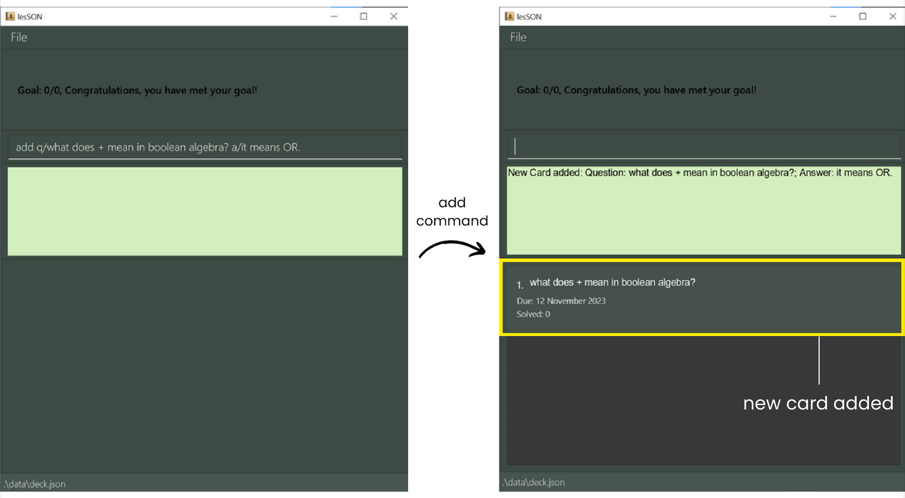
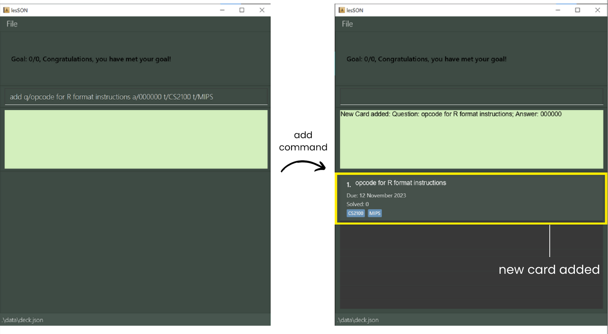
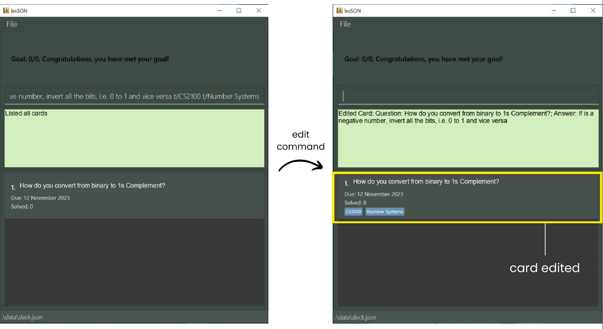
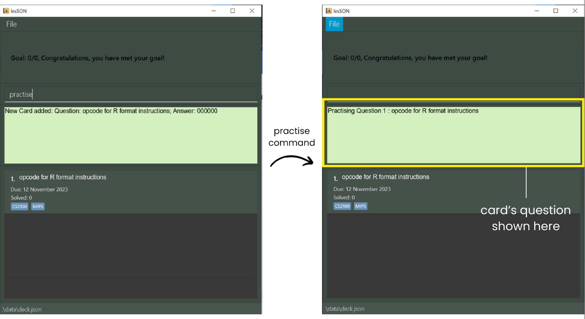
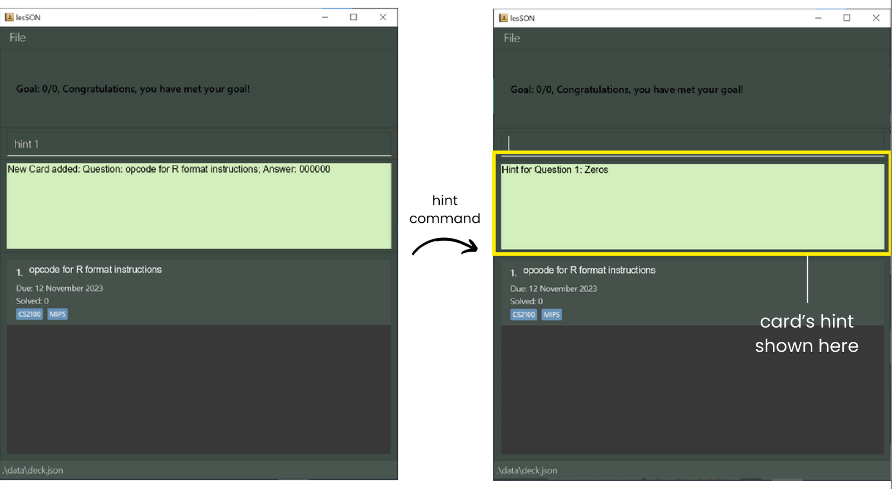
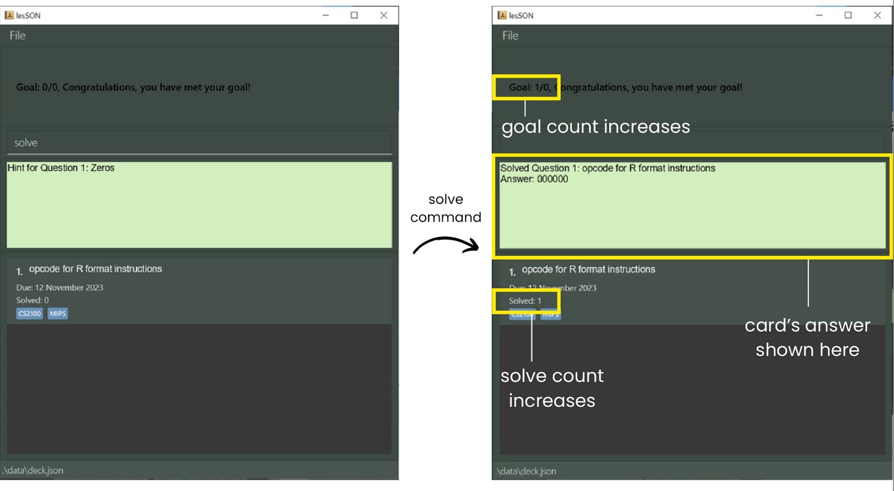
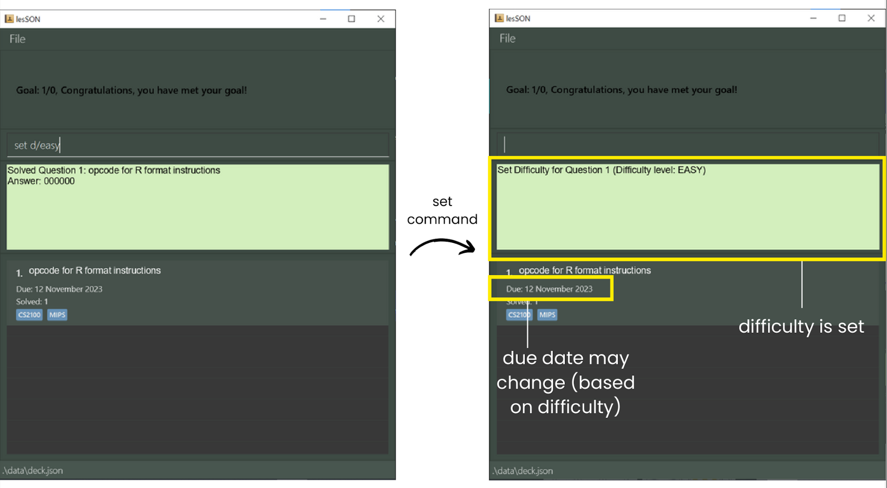
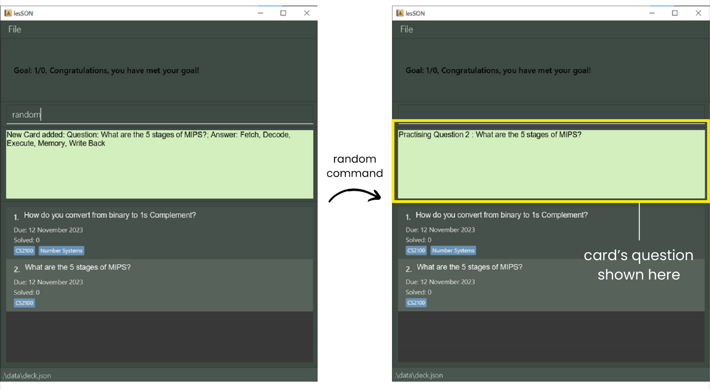

# User Guide for <span style="color: green;">lesSON</span>

## Table of Contents
1. [Introduction](#introduction)
2. [How to use the guide](#how-to-use-this-guide)
3. [Glossary](#glossary)
4. [Quick start](#quick-start)
5. [Feature list](#feature-list)
   - [Adding a Flashcard](#adding-a-flashcard--add)
   - [Deleting a Flashcard](#deleting-a-flashcard--delete)
   - [View All Flashcards](#view-all-flashcards--list)
   - [Editing a Specific Flashcard](#editing-a-specific-flashcard--edit)
   - [Practise Flashcards](#practise-flashcards--practise)
   - [Hints for Flashcards](#hints-for-flashcards--hint)
   - [Solve Flashcards](#solving-flashcards--solve)
   - [Setting Difficulty for Flashcards](#setting-difficulty-of-flashcards--set)
   - [Randomly Practise Flashcards](#randomly-practise-flashcards--random)
   - [Clear all Flashcards](#clear-all-flashcards--clear)
   - [Setting goals](#setting-goals--goal)
   - [Getting help](#getting-help--help)
   - [Exiting lesSON](#exiting-lesson--exit)
6. [Additional Features](#additional-features)
   - [Markdown Syntax](#markdown-syntax)
   - [Importing and Exporting Decks](#importing-and-exporting-decks)
7. [FAQ](#frequently-asked-questions-faq)
8. [Known Issues](#known-issues)
9. [Contact Us](#contact-us)

<div style="page-break-after: always;"></div>

--------------------------------------------------------------------------------------------------------------------

## Introduction

#### ***Revolutionise your studying experience with <span style="color: green;">lesSON</span>!***

Welcome to the user guide for <span style="color: green;">lesSON</span>, your ultimate companion in mastering the
Computer Science curriculum at the National University of Singapore (NUS). This guide is designed to provide you with a
comprehensive understanding of the app and how to leverage its powerful features for your academic success.

#### What is <span style="color: green;">lesSON</span>?

<span style="color: green;">lesSON</span> is not just another study app; it's a game-changer in the world of education.
Tailored specifically for NUS Computer Science students, this **desktop application** enables incredibly easy creation
of flashcards for revision. It employs the efficacy of [active recall](#definitions) when you practise with the
[flashcards](#definitions) you made to increase memory retention. Say goodbye to time-consuming note-taking,
and say hello to a more efficient, effective, and enjoyable study experience.

Made with the intention to maximise your study experience, here are some features we believe you'll love:
1. **Enhanced Memory Retention:** Thanks to <span style="color: green;">lesSON</span>'s inbuilt [spaced repetition](#definitions) system, you can
supercharge your memory and recall the important details needed. The app optimizes when you should review your
flashcards, ensuring you remember and grasp complex concepts with ease.
2. **Intuitive Card Categorisation:** <span style="color: green;">lesSON</span> helps you categorize your flashcards based on subject. This feature
makes it a breeze to organize and access specific topics, keeping your study sessions focused and productive.

*... and many more!*

#### Prerequisites

Before you get started with <span style="color: green;">lesSON</span>, here's what we recommend you need to make
full use of the app:

- **Comfortable with English**: Since <span style="color: green;">lesSON</span> is an English-based app, a basic
understanding of the language will ensure a smooth and enjoyable experience.
- **Typing Proficiency**: <span style="color: green;">lesSON</span> primarily uses a
[Command Line Interface (CLI)](#definitions) on top of a [Graphic User Interface (GUI)](#definitions). This means that
most of the interaction with <span style="color: green;">lesSON</span> is through the use of [keystrokes](#definitions).
Being comfortable and efficient at typing will help you make the most of the app and enhance your user experience.

[Go to Table of Contents](#table-of-contents)

<div style="page-break-after: always;"></div>

--------------------------------------------------------------------------------------------------------------------

## How to use this guide?

### Directory
If you are a first time user, do visit our seamless onboarding process explained in the
[quick start](#quick-start) section. <br>
<br>
For beginners, we recommend familiarising yourself with the basic commands shown in our [tutorial](#tutorial)
for new users. <br>
<br>
If you are already comfortable using <span style="color: green;">lesSON</span>, do try out all of our other [features](#feature-list). <br>

### Legend
Throughout this user guide, you will encounter some of these colored blocks highlighting some important information.

<div markdown="span" class="alert alert-success">
    💡 Green blocks contains examples that you can follow on <span style="color: green;">lesSON</span> yourself!
</div>

<div markdown="span" class="alert alert-info">
    ℹ️ Blue blocks contain useful tips to enhance your experience while using <span style="color: green;">lesSON</span>.
</div>

<div markdown="span" class="alert alert-danger">
    ⚠️ 
The red block contains crucial warnings for ensuring the proper functionality of <span style="color: green;">lesSON</span>.
</div>

[Go to Table of Contents](#table-of-contents)

<div style="page-break-after: always;"></div>

--------------------------------------------------------------------------------------------------------------------

## Glossary

### Definitions

|             Term             | Definition                                                                                                                                                                                     |
|:----------------------------:|:-----------------------------------------------------------------------------------------------------------------------------------------------------------------------------------------------|
|        Active recall         | A popular method to strengthen memory retention by actively testing the memory to retrieve a piece of information.                                                                             |
| Command Line Interface (CLI) | A text-based interface where you interact with the software by typing commands into a terminal or command prompt, providing more direct and precise control over the system.                   |
|          Flashcard           | A card created by the user containing a question, answer (not shown) and due date.                                                                                                             |
| Graphic User Interface (GUI) | A user-friendly interface that allows you to interact with the software through visual elements like windows, icons, buttons, and menus, making it easy to navigate with a mouse and keyboard. |
|          Keystrokes          | Act of pressing a key on a computer keyboard                                                                                                                                                   |
|      Spaced repetition       | An evidence-based learning technique where newly created and more difficult flashcards are shown more frequently than older and less difficult flashcards                                      |


### Parameter Information

The parameters used in <span style="color: green;">lesSON</span> have certain specifications. Here is an overview of how to use the parameters.
Invalid inputs given as examples are non-exhaustive.

| Parameter  | Prefix | Accepted Format                                                                                                         | Valid Input                                               | Invalid Input |
|------------|--------|-------------------------------------------------------------------------------------------------------------------------|-----------------------------------------------------------|---------------|
| QUESTION   | q/     | Alphanumerical values, whitespace and certain special characters                                                        | How many types of instruction formats are there for MIPS? | 什么            | 
| ANSWER     | a/     | Alphanumerical values, whitespace and certain special characters                                                        | The opcode for R-format instruction is 000000.            | こんにちは         |
| TAG        | t/     | Alphanumerical values.                                                                                                  | CS2100                                                    | !factorials   |
| HINT       | h/     | Alphanumerical values, whitespace and certain special characters                                                        | 1 + 1                                                     | 💡            |
| DIFFICULTY | d/     | Only "easy", "medium" or "hard" (case-insensitive).                                                                     | easy                                                      | difficult     |
| INDEX      | NA     | Positive integer less than size of deck or `r` for certain cases (see [random](#randomly-practise-flashcards--random)). | 1                                                         | 0             |
| NUMBER     | NA     | Positive integer not more than 2147483647                                                                               | 1000                                                      | 2147483648    |

<div markdown="span" class="alert alert-info">
    ℹ️ Special characters include the following: !@#$%^&*(),./?";:{}[]-=_+<>
</div>

### Command Format

| Format                                                                                 | Details                                                                                                                                                                       | Example                                                                                                                           |
|----------------------------------------------------------------------------------------|-------------------------------------------------------------------------------------------------------------------------------------------------------------------------------|-----------------------------------------------------------------------------------------------------------------------------------|
| `UPPER_CASE` parameters                                                                | Compulsory parameter to be filed in by users. Must not be empty or contain only whitespace (except in certain cases: see [edit](#editing-a-specific-flashcard--edit)).        | `add q/QUESTION a/ANSWER` means users need to input a question after the `q/` prefix and an answer after the `a/` prefix.         |
| Parameters with square brackets, i.e. `[ ]`                                            | Optional parameters that can be omitted when entering the command.                                                                                                            | `add q/QUESTION a/ANSWER [h/HINT]` means users can choose to omit hints when adding a card.                                       |
| Parameters with ellipsis, i.e. `...`                                                   | Command can take in multiple of the same parameter.                                                                                                                           | `add q/QUESTION a/ANSWER [t/TAG...]` means user can choose to add multiple tags while creating the card, each with a prefix `t/`. |
| Certain combinations of characters are not allowed, i.e characters that form a prefix. | Inputs that contain prefixes are not valid inputs.                                                                                                                            | Having `q/`, `a/`, `t/`, `h/` or `d/` in certain input fields.                                                                    |
| Inputs are case-sensitive.                                                             | Cards with question that differ only in case will be regarded as different cards.                                                                                             | `add q/QUESTION a/ANSWER` and `add q/question a/answer` will generate 2 different cards.                                          | 
| The order of prefix does not matter.                                                   | Prefix can be reordered without having any effect on the command.                                                                                                             | `add q/QUESTION a/ANSWER` and `add a/ANSWER q/QUESTION` are both valid inputs that generates the same card.                       |
| Commands that do not take in any parameters will disregard extraneous parameters.      | Certain commands such as `help`, `clear`, `exit`, `random` and `list` (in certain cases: see [list](#view-all-flashcards--list)) will disregard any inputs after the command. | `help 123 ` or `clear a/abc` will be regarded as `help` and `clear` respectively.                                                 |

<div markdown="span" class="alert alert-info">
    ℹ️ If you are using a PDF version of this document, do take note when copying and pasting commands that span 
multiple lines as whitespace characters before line-breaks may be omitted when copied.
</div>


[Go to Table of Contents](#table-of-contents)

--------------------------------------------------------------------------------------------------------------------

## Quick Start

Get ready to embark on your productive study session with <span style="color: green;">lesSON</span>!

### Installation

1. Make sure that you have [Java 11 or above](https://www.java.com/en/download/) installed on your computer.
   - [How do I check my version of Java installed?](#check-version-of-java-installed)
   - For macOS users, follow the instructions listed [here](https://nus-cs2103-ay2324s1.github.io/website/admin/programmingLanguages.html) instead to install Java.
2. Download the latest `lesSON.jar` file from [here](https://github.com/AY2324S1-CS2103T-W17-4/tp/releases/tag/v1.4).
3. Move the jar file to a working folder where you would store all of your flashcards.
4. Launch <span style="color: green;">lesSON</span>.
   - For Windows users:
      - Open the folder where `lesSON.jar` was moved to.
      - Double-click `lesSON.jar` to start the application.
   - For macOS users,
     - Open a new Terminal window<br>
     Press <kbd>Command</kbd> + <kbd>Space</kbd> and type Terminal, then press <kbd>Enter</kbd>.
     - Navigate to the folder where you have stored the jar file using the `cd` command.
       - [Not sure how to use cd?](https://www.ibm.com/docs/en/aix/7.2?topic=directories-changing-another-directory-cd-command)
     - Type `java -jar lesSON.jar` and press <kbd>Enter</kbd>.
5. You should be able to see the [GUI](#glossary) pop up on your screen.

### Navigating the app

<span style="color: green;">lesSON</span> uses a [Graphical User Interface (GUI)](#glossary) to display the flashcards
you have created to you. Here is a brief overview of the GUI to help you familiarise yourself with the key elements and
their locations.


Here is a summary of what each component in the GUI displays.

| Name of component | Description                                                                                                                                                |
|:-----------------:|------------------------------------------------------------------------------------------------------------------------------------------------------------|
|    Menu button    | Lists the Help, Import, Export and Exit buttons when pressed.                                                                                              |
|       Goal        | Displays the number of flashcards to practise for the session.                                                                                             |
| Command Line Box  | Interface for users to input commands.                                                                                                                     |
|    Result Box     | Displays the results of inputted command back to the user. Error messages will be shown to guide the user to the correct input if the input was incorrect. |
|       Deck        | Lists all the flashcards in a scrollable view. The deck can be filtered using commands.                                                                    |
|       Card        | Displays the key information of a flashcard such as its question, tags and index.                                                                          |
|      Footer       | Displays where the storage of flashcards is located at.                                                                                                    |

### Tutorial

This is a tutorial for **first-time** and **beginner** <span style="color: green;">lesSON</span> users. For more advanced users,
feel free to explore the other features in the [command summary](#command-summary) instead. In this tutorial, we will explain how to
*add, edit, tag, and practise* your flashcards.

1. Launch <span style="color: green;">lesSON</span>.
   - Refer to the instructions [here](#installation) if you are unsure how to launch
   <span style="color: green;">lesSON</span>.
   <div markdown="span" class="alert alert-info">
      ℹ️ Note that users who are launching <span style="color: green;">lesSON</span> for the first time will have an empty deck.
   </div>


2. First, let's try to add your very first flashcard. Type the following command and hit <kbd>Enter</kbd>: <br>
`add q/what does + mean in boolean algebra? a/it means OR.`



3. Congratulations, you have created your first flashcard! Now, let's try to edit the card created from the
previous input by capitalising it! Note that the flashcard just created is at index `1`. Type the following command
and hit <kbd>Enter</kbd>: <br>`edit 1 q/What does + mean in boolean algebra? a/It means OR.`


4. Next, let's tag it under the module CS1231S. Type the following command and hit <kbd>Enter</kbd>:
<br>`edit 1 t/CS1231S`


5. Let's add another flashcard. Type the following command and hit <kbd>Enter</kbd>: <br>
`add q/What are the different hazards to consider when using pipelining? a/Structural, Data and Control t/CS2100`


6. Feel free to add a few more cards by following steps 1 to 4!


7. Next, to practise the first card, do: <br> `practise`


8. Try to recall the answer, and when you are ready to reveal the answer, type the following command and hit
<kbd>Enter</kbd>: <br>`solve`


9. How hard was the answer to recall? Set the difficulty of the flashcard by typing any of the following command and hit
<kbd>Enter</kbd>: <br>
`set d/easy`<br>
`set d/medium`<br>
`set d/hard`


10. The flashcard will automatically be reinserted into deck. This is based on how difficult you found the question
to be. With our inbuilt [spaced repetition](#glossary) system, as you practise, flashcards you find more difficult will
surface more at the top.


11. Note that the `practise`, `solve`, and `set` commands support indexes, but we recommended to use them without
indexes as shown in this tutorial. This is to optimise the effectiveness of the [spaced repetition](#glossary) by
testing your memory with the most difficult flashcard.


12. Get familiar with these commands and when you are ready, move on to the other commands listed [here](#command-summary).

[Go to Table of Contents](#table-of-contents)

<div style="page-break-after: always;"></div>

--------------------------------------------------------------------------------------------------------------------

# Feature list

## Command Summary

| Command                                         | Description                             |
|-------------------------------------------------|-----------------------------------------|
| [add](#adding-a-flashcard--add)                 | Adds a Flashcard to the deck.           |
| [delete](#deleting-a-flashcard--delete)         | Removes a Flashcard from the deck.      |
| [list](#view-all-flashcards--list)              | Displays a specified set of Flashcards. |
| [edit](#editing-a-specific-flashcard--edit)     | Modifies an existing Flashcard.         |
| [practise](#practise-flashcards--practise)      | Practises a Flashcard.                  |
| [hint](#hints-for-flashcards--hint)             | Shows the hint set for a Flashcard.     |
| [solve](#solving-flashcards--solve)             | Solves a Flashcard.                     |
| [set](#setting-difficulty-of-flashcards--set)   | Sets the difficulty for a Flashcard.    |
| [random](#randomly-practise-flashcards--random) | Practises a random Flashcard.           |
| [clear](#clear-all-flashcards--clear)           | Removes all Flashcards from the deck.   |
| [goal](#setting-goals--goal)                    | Sets the goal for the session.          |
| [help](#getting-help--help)                     | Shows link to User Guide.               |
| [exit](#exiting-lesson--exit)                   | Exits and closes the application.       |


## Commands

### Adding a Flashcard : `add`

Adds a flashcard to the deck for the user.

#### Format:
>```add q/QUESTION a/ANSWER [t/TAG...] [h/HINT]```

#### Examples:

_A flashcard with only a question and answer field._
>```add q/What are the three ways to implement binary systems? a/1s Complement, 2s Complement, and Sign and Magnitude```

_A flashcard with a question, answer and tag field._
>```add q/How do you convert from binary to 1s Complement? a/By inverting all the bits, i.e. 0 to 1 and vice versa t/CS2100 t/Number Systems```

_A flashcard with a question, answer, tag and hint field._
>```add q/What are the 5 stages of MIPS? a/Fetch, Decode, Execute, Memory, Write Back t/CS2100 h/5 stages: IF, ID, EX, MEM, WB```

<div markdown="span" class="alert alert-success">

   💡 **Try It Yourself:**<br>

   1. User Input:<br>
      `add q/opcode for R format instructions a/000000 t/CS2100 t/MIPS`<br>

   2. Successful Output:<br>
      i. Result box displays:<br>
         `New Card added: Question: opcode for R format instructions; Answer: 000000`<br>
      ii. The corresponding card with the **question**, **due date**, **solve count** and **tags** is created and added to the deck.<br>
         
</div>

[Go to Command Summary](#command-summary)

### Deleting a Flashcard : `delete`
Deletes a flashcard in the deck

#### Format:
>```delete INDEX```

#### Examples:
_Deleting the card in the deck with an index of 2._
>```delete 2```

<div markdown="span" class="alert alert-success">

💡 **Try It Yourself:**<br>

   1. User Input: <br>
      `add q/opcode for R format instructions a/000000 t/CS2100 t/MIPS`<br>
      `delete 1`<br>

   2. Successful Output:<br>
      i. Result box displays:<br>
         `Deleted Card: Question: opcode for R format instructions; Answer: 000000`<br>
      ii. The corresponding card is deleted from the deck.<br>
         
</div>

[Go to Command Summary](#command-summary)

### View All Flashcards : `list`
Shows a list of all flashcards in the deck. A keyword may be specified to filter out the list.

#### Format: 
>```list [q/QUESTION] [t/TAG...]```
### Examples:
_List full deck of flashcards._
>```list```

_List all flashcards with question starting with "What"._
>```list q/What```

_List all flashcards with the CS2100 Tag._
>```list t/CS2100```

<div markdown="span" class="alert alert-danger">

⚠️ **Warning:**<br>

1. Any extraneous parameters not `q/` and `t/` will be ignored, i.e. `list 12345` or `list a/000000` will be regarded as `list`.<br>
2. Listing questions with markdown syntax should include their relevant markdown notation, i.e. `list q/**What**` for questions starting with **What**.<br>
3. Newly added cards may not appear if they do not match the current filter.
</div>

<div markdown="span" class="alert alert-success">

💡 **Try It Yourself:**<br>

   1. User Input:<br>
      `add q/What are the three ways to implement binary systems? a/1s Complement, 2s Complement, and Sign and Magnitude`<br>
      `add q/What are the 5 stages of MIPS? a/Fetch, Decode, Execute, Memory, Write Back t/CS2100`<br> 
      `list t/CS2100`<br>

   2. Successful Output:<br>
      i. Result box displays: <br>
         `All cards listed`<br>
      ii.The corresponding cards matching the keyword and tags is displayed.<br>
   
</div>

[Go to Command Summary](#command-summary)

### Editing a Specific Flashcard : `edit`
Edits an existing Flashcard in the deck.

#### Format:
>```edit INDEX [q/QUESTION] [a/ANSWER] [t/TAG...] [h/HINT]```

#### Examples:
_Change the question at index 1 to "What is the colour of the sun?"._
>```edit 1 q/What is the colour of the sun?```

_Change the answer at index 1 to "Red"._
>```edit 1 a/Red```

_Change the tag at index 1 to "Weather" and "Geography"._
>```edit 1 t/Weather t/Geogaphy```

_Change the hint at index 1 to "Apple"._
>```edit 1 h/Apple```

<div markdown="span" class="alert alert-danger">

⚠️ **Warning:**<br>

1. There must be **at least** one optional parameter included for the command input.<br>
2. Empty input after `t/` and `h/` will remove existing tags or hint respectively.
</div>

<div markdown="span" class="alert alert-success">

💡 **Try It Yourself:**<br>

1. User Input:<br>
   `add q/How do you convert from binary to 1s Complement? a/By inverting all the bits, i.e. 0 to 1 and vice versa`<br>
   `edit 1 a/If is a negative number, invert all the bits, i.e. 0 to 1 and vice versa t/CS2100 t/Number Systems`<br>

2. Successful Output:<br>
    i. Result box displays:<br>
       `Edited Card: Question: How do you you convert from binary to 1s Complement?; Answer: If is a negative number, invert all the bits, i.e. 0 to 1 and vice versa`<br>
    ii. The corresponding card in the deck will be updated.<br>
       
</div>

[Go to Command Summary](#command-summary)

### Practise Flashcards : `practise`
Practise a single Flashcard in the deck

#### Format:
>```practise [INDEX]```

#### Examples:
_Practising the card in the deck with an index of 2._
>```practise 2```

<div markdown="span" class="alert alert-info">

ℹ️  **To Note:**<br>

1. If user omits INDEX in the command input, the first card in the deck will be practised.
</div>

<div markdown="span" class="alert alert-success">

💡 **Try It Yourself:**<br>

1. User Input:<br>
   `add q/opcode for R format instructions a/000000 t/CS2100 t/MIPS`<br>
   `practise`<br>

2. Successful Output:<br>
   i. Result box displays: <br>
   `Practising Question 1 : opcode for R format instructions`<br>
   
</div>

[Go to Command Summary](#command-summary)

### Hints for Flashcards : `hint`
See the hint for a question at the given index

Format: 
>```hint INDEX```

#### Examples:
_Hint the card in the deck with an index of 3._
>```hint 3```

<div markdown="span" class="alert alert-info">

ℹ️  **To Note:**<br>

1. If no hints are set for card at INDEX, `No Hint has been provided` will be displayed in the result box.
</div>

<div markdown="span" class="alert alert-success">

💡 **Try It Yourself:**<br>

1. User Input:<br>
   `add q/opcode for R format instructions a/000000 t/CS2100 t/MIPS h/Zeros`<br>
   `hint 1`<br>

2. Successful Output:<br>
   i. Result box displays:<br>
   `Hint for Question 1: Zeros`<br>
   
</div>

[Go to Command Summary](#command-summary)

### Solving Flashcards : `solve`
Solves the question at the given index

Format: 
>```solve [INDEX]```

#### Examples:
_Solve the card in the deck with an index of 2._
>```solve 2```

<div markdown="span" class="alert alert-info">

ℹ️  **To Note:**<br>

1. If user omits INDEX in the command input, the first card in the deck will be solved.
</div>

<div markdown="span" class="alert alert-success">

💡 **Try It Yourself:**<br>

1. User Input:<br>
   `add q/opcode for R format instructions a/000000 t/CS2100 t/MIPS h/Zeros`<br>
   `solve`<br>

2. Successful Output:<br>
   i. Result box displays:<br>
   `Solved Question 1: opcode for R format instructions Answer: 000000`<br>
   ii. Solve count of the card gets updated.<br>
   
</div>

[Go to Command Summary](#command-summary)

### Setting Difficulty of Flashcards : `set`
Setting the difficulty of a flashcard, based on the user.

Format: 
>```set [INDEX] d/DIFFICULTY```

#### Example:
_Set the first card as easy_
>```set 1 d/easy```

<div markdown="span" class="alert alert-info">

ℹ️  **To Note:**<br>

1. If user omits INDEX in the command input, the first card in the deck will be set.
</div>

<div markdown="span" class="alert alert-success">

💡 **Try It Yourself:**<br>

1. User Input:<br>
   `add q/opcode for R format instructions a/000000 t/CS2100 t/MIPS h/Zeros`<br>
   `set d/easy`<br>

2. Successful Output:<br>
   i. Result box displays:<br>
      `Set Difficulty for Question 1 (Difficulty level: EASY)`<br>
   ii. Due date of the card updated.<br>
   
</div>

[Go to Command Summary](#command-summary)

### Randomly Practise Flashcards : `random`
Practise a single random Flashcard in the deck.

#### Format: 
>```random```

#### Examples:
_Practise a random card._
>```random```

<div markdown="span" class="alert alert-info">

ℹ️  **To Note:**<br>

1. Users can use `r` as the index with commands solve and set for the randomly selected question.<br>
2. As of v1.4 Hint does not support random and `r`.
</div>

<div markdown="span" class="alert alert-success">

💡 **Try It Yourself:**<br>

1. User Input:<br>
   `add q/How do you convert from binary to 1s Complement? a/By inverting all the bits, i.e. 0 to 1 and vice versa t/CS2100 t/Number Systems`<br>
   `add q/What are the 5 stages of MIPS? a/Fetch, Decode, Execute, Memory, Write Back t/CS2100 h/5 stages: IF, ID, EX, MEM, WB`<br>
   `random`<br>

2. Successful Output (assuming random chooses the card at index 2):<br>
   i. Result box displays:<br>
   `Practising Question 2 : What are the 5 stages of MIPS?`<br>
   
</div>

[Go to Command Summary](#command-summary)

### Clear All Flashcards : `clear`
Clears all flashcards found in the Deck. Deck is reset back to empty.

#### Format: 
>```clear```

#### Example:
_Delete all flashcards from the deck._
>```clear```

<div markdown="span" class="alert alert-danger">

⚠️ **Warning:**<br>

1. This action removes all cards and is irreversible!
</div>

<div markdown="span" class="alert alert-success">

💡 **Try It Yourself:**<br>

1. User Input<br>
   `add q/How do you convert from binary to 1s Complement? a/By inverting all the bits, i.e. 0 to 1 and vice versa t/CS2100 t/Number Systems`<br>
   `clear`<br>

2. Successful Output<br>
   i. Result box displays:<br>
   `Deck has been cleared!`<br>
      
</div>

[Go to Command Summary](#command-summary)

### Setting Goals : `goal`
Set a goal for the current studying session.

#### Format:
>```goal NUMBER```

#### Example:
_Set a goal of 5 for this session._
>```goal 5```

<div markdown="span" class="alert alert-info">

ℹ️  **To Note:**<br>

1. On initialisation of <span style="color: green;">lesSON</span>, the target of the goal will be the size of the deck and the number of cards solved will be 0.
</div>

<div markdown="span" class="alert alert-success">

**💡 Try It Yourself:<br>**

1. User Input:<br>
   `goal 10`<br>

2. Successful Output:<br>
   i. Result box displays:<br>
   `New goal set.`<br>
   ii. Goal box updated with new target and goal completion status.<br>
      
</div>

[Go to Command Summary](#command-summary)
      
### Getting Help : `help`
Seek more details from a link provided leading to the User Guide.
Users can also access this function by clicking on the **File** button located at the top
left of the application, and then navigating to the **Help** tab.

#### Format: 
>```help```

#### Example:
_Open help window._
>```help```


<div markdown="span" class="alert alert-success">

💡 **Try It Yourself:**<br>

1. User Input:<br>
   `help`<br>

2. Successful Output:<br>
   i. Result box displays:<br>
   `Opened help window.`<br>
   ii. Popup window with link to User Guide is generated.<br>
      
</div>

[Go to Command Summary](#command-summary)

### Exiting <span style="color: green;">lesSON</span> : `exit`
Exits and closes the <span style="color: green;">lesSON</span> application.

#### Format:
>```exit```

#### Example:
_Closes <span style="color: green;">lesSON</span>._
>```exit```

<div markdown="span" class="alert alert-success">

💡 **Try It Yourself:**<br>

1. User Input:<br>
   `exit`<br>

2. Successful Output:<br>
   i. <span style="color: green;">lesSON</span> closes.
</div>

[Go to Command Summary](#command-summary) <br>
[Go to Table of Contents](#table-of-contents)

<div style="page-break-after: always;"></div>

--------------------------------------------------------------------------------------------------------------------

## Additional Features

### Markdown Syntax

For user who wish to incorporate styling in <span style="color: green;">lesSON</span>, there are 3 font styles currently supported:
1. Bold
2. Italic
3. Underline

#### Bold
To bold a line of text, wrap text as follows `**text**`


#### Example:
_Bolding a phrase in the question_
>```edit 1 q/How many bits can a **Half Adder** add up```

<div markdown="span" class="alert alert-success">

   💡 **Try It Yourself:**<br>

1. User Input:<br>
   `add q/What is the **Stage** where calculations are operated? a/ALU`<br>

2. Successful Output:<br>
   i. Result box displays:<br>
   `New Card added: Question: What is the Stage where calculations are operated?; Answer: ALU`<br>
   ii. The corresponding card with the **question**, **due date**, **solve count** and **tags** is created and added to the deck.<br>
   iii. `Stage` will appear bolded in both instances.<br>

</div>

#### Italic
To italicise a line of text, wrap text as follows `*text*`

#### Example:
_Italicising a phrase in the question_
>```edit 1 q/How many bits can a *Half Adder* add up```

<div markdown="span" class="alert alert-success">

   💡 **Try It Yourself:**<br>

1. User Input:<br>
   `add q/What is the *Stage* where calculations are operated? a/ALU`<br>

2. Successful Output:<br>
   i. Result box displays: `New Card added: Question: What is the Stage where calculations are operated?; Answer: ALU`<br>
   ii. The corresponding card with the **question**, **due date**, **solve count** and **tags** is created and added to the deck.<br>
   iii. `Stage` will appear italicised in both instances.<br>
      
</div>

#### Underline
To underline a line of text, insert `<u>` at the beginning of the text,
and end with `</u>` at the end of the underlined text.

#### Example:
_Underlining a phrase in the question_
>```edit 1 q/How many bits can a <u>Half Adder</u> add up```

<div markdown="span" class="alert alert-success">

💡 **Try It Yourself:**<br>

1. User Input:<br>
   `add q/What is the <u>Stage</u> where calculations are operated? a/ALU`<br>

2. Successful Output:<br>
   i. Result box displays: `New Card added: Question: What is the Stage where calculations are operated?; Answer: ALU`<br>
   ii. The corresponding card with the **question**, **due date**, **solve count** and **tags** is created and added to the deck.<br>
   iii. `Stage` will appear underlined in both instances.<br>
            
</div>

<div markdown="span" class="alert alert-danger">

⚠️ **Warning:**<br>

1. Do not stack Markdown Syntax, e.g. `edit 1 q/<u>**Example Question**</u>`. This may lead to unexpected behavior of text in the display view.<br> 
2. Do ensure that the phrase intended for styling is wrapped within an open and close syntax of the same type, i.e. `**text**` for bold `*text*` for italics and `<u>text</u>` for underline.<br> 
3. Do ensure that there is no empty input between an open and close syntax.<br>
4. In the case when unexpected Markdown format is observed, edit the flashcard again with the without the Markdown syntax/with appropriate syntax.
</div>

## Importing and Exporting Decks

<div markdown="span" class="alert alert-info">

ℹ️  **To Note:**<br>

The import and export functions are meant to be used before and after revision respectively <br>

They are not to be confused as commands input by user, but rather as a method to transfer and import data easily <br>

</div>

Users can share their own Decks with others or download their Decks to their own.
Both import and export features reside in the **File** menu.

### Export
Users can share their own Deck by clicking on the `Export` button. Their own Deck
will be displayed as a JSON file which can be easily copied either through the `Copy Data`
button provided or other means.

### Import
Users can enjoy the Decks of others by clicking on the `Import` button. A text field
is displayed for users to paste in the JSON file containing the decks of others. The
app will close upon clicking the `Import Data` button. Users will have to rerun the app
to see their new decks.

<div markdown="span" class="alert alert-danger">

   ⚠️ Caution

   All data is saved as a JSON file at this specified path: [JAR file location]/data/deck.json. <br>
   It is **NOT** recommended for users to modify data directly as it can cause the app to malfunction. <br>
   If you still wish to proceed with modifying the data directly, <span style="color: green;">lesSON</span> would not be held accountable of the risks of such actions.

</div>

[Go to Table of Contents](#table-of-contents)

<div style="page-break-after: always;"></div>

--------------------------------------------------------------------------------------------------------------------

## Frequently Asked Questions (FAQ)

### Check version of Java installed

**Q:** How do I check my version of Java I have installed on my computer? <br>
**A:** Open up a command prompt and type `java -version` and hit <kbd>Enter</kbd>.

Shortcut to open the command prompt:
- For Windows: Press <kbd>Windows</kbd> + <kbd>R</kbd> and enter `cmd`.
- For macOS: Press <kbd>Command</kbd> + <kbd>Space</kbd> and enter `Terminal`.

### App not showing

**Q:** The application is running fine, but I am unable to see the [GUI](#definitions). What should I do? <br>
**A:** This is a currently [known issue](#known-issues) with a temporary hotfix. We are working on a solution.

[Go to Table of Contents](#table-of-contents)

--------------------------------------------------------------------------------------------------------------------

## Known Issues

1. Users can create **duplicate** tags for the same flashcard. We plan to enforce uniqueness of tags for a
flashcard in future enhancements. Until then, please do take caution to avoid adding duplicate tags for the same
flashcard. 


2. The app **may not show** for users with multiple displays. If you relocate the app to a secondary display and
subsequently cease using the secondary display, the app will continue to run but will no longer be visible on your
primary display. Closing the app and re-running it will not solve the issue. We are working on a solution but until then,
we recommend relocating the app back to your main display before disconnecting your secondary display.

If you encountered any other bugs or errors, do let us know with the relevant details (e.g. screenshots) via our
official channels found [here](https://ay2324s1-cs2103t-w17-4.github.io/tp/AboutUs.html).

[Go to Table of Contents](#table-of-contents)

--------------------------------------------------------------------------------------------------------------------

## Contact Us

For any feedback or relevant queries, do contact us via our [official channels](https://ay2324s1-cs2103t-w17-4.github.io/tp/AboutUs.html).

[Go to Table of Contents](#table-of-contents)

--------------------------------------------------------------------------------------------------------------------

<p style="text-align: center;">— End of User Guide —</p>
